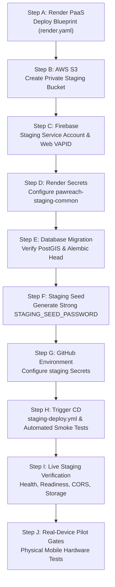

# PawReach Staging Activation & Operator Handoff Checklist
**Phase 2.9E — Real Cloud Staging Provisioning & Controlled Pilot Validation**

> [!NOTE]
> **SUPERSEDED**: This checklist is preserved for historical audit. The active zero-cost setup sequence is in [FREE_DEPLOYMENT.md](FREE_DEPLOYMENT.md) and live validation record in [LIVE_STAGING_VALIDATION.md](LIVE_STAGING_VALIDATION.md).

```text
================================================================================
STAGING STATUS:
STAGING CONFIGURATION READY — EXTERNAL ACTION REQUIRED
================================================================================
```

This checklist is the authoritative, step-by-step operational procedure for a human infrastructure operator to provision, configure, and activate the real cloud staging environment for PawReach on **Render**, **AWS S3**, **Firebase**, and **GitHub Actions**.

---

## 1. Overview & Operational Principles

1. **Evidence-Based Certification**:
   The application codebase, database migrations, security policies, background task engine, and CI test suites are certified green (`CODE_VERIFIED`). Staging configuration files and verification scripts are fully validated in the repository (`STAGING_CONFIGURATION_READY`). No cloud deployment may be claimed until the operator executes the steps below and live smoke tests pass (`STAGING_DEPLOYED`).
2. **Zero Hardcoded Secrets**:
   Never commit cloud credentials, private keys, service account JSON, or database passwords into Git. All secrets must be supplied through Render Environment Groups or GitHub Environment Secrets.
3. **Fail-Closed Security**:
   In `staging` mode, the backend (`app/config.py`) rejects SQLite, rejects weak/default JWT secrets (< 32 chars), rejects CORS wildcard `*`, and requires valid Redis/S3 configurations.
4. **Placeholders Used**:
   Throughout this document, `<STAGING_API_URL>` and `<STAGING_FRONTEND_URL>` represent the actual URLs assigned by Render upon creation.

---

## 2. Step-by-Step Operator Activation Sequence



---

### Step A — Render PaaS Provisioning (Blueprint Deployment)

1. Sign in to the [Render Dashboard](https://dashboard.render.com/).
2. Click **New +** $\to$ **Blueprint**.
3. Connect the GitHub repository:
   - **Repository**: `Abhiram-C-Divakaran/PawSOS`
   - **Branch**: `main`
4. Render automatically parses [`render.yaml`](../render.yaml) and provisions the following 6 resources in region `oregon`:
   - [x] **`pawreach-staging-api`** (Web Service, Python 3.12, Uvicorn 2 workers)
     - Health check path: `/api/v1/health`
     - Pre-deploy command: `cd backend && alembic upgrade head`
     - Start command: `uvicorn app.main:app --app-dir backend --host 0.0.0.0 --port $PORT --workers 2`
   - [x] **`pawreach-staging-worker`** (Background Worker, Python 3.12)
     - Start command: `celery -A app.tasks.celery_app.celery_app --workdir backend worker --loglevel=INFO -Q dispatch,notifications,default`
   - [x] **`pawreach-staging-beat`** (Singleton Background Worker, `numInstances: 1`)
     - Start command: `celery -A app.tasks.celery_app.celery_app --workdir backend beat --loglevel=INFO --pidfile=/tmp/celerybeat.pid`
   - [x] **`pawreach-staging-frontend`** (Static Site, Node.js / Vite build)
     - Build command: `npm --prefix frontend ci && npm --prefix frontend run build`
     - Publish directory: `./frontend/dist`
     - Rewrite rule: `/* -> /index.html` (enables SPA client-side deep routing)
   - [x] **`pawreach-staging-redis`** (Managed Redis 7+, `noeviction` maxmemory policy)
   - [x] **`pawreach-staging-db`** (Managed PostgreSQL 15+ with PostGIS)
5. **Verify Process Separation & Singleton Beat**:
   - Confirm API, Worker, and Beat are 3 distinct services in the Render Dashboard.
   - Confirm `pawreach-staging-beat` has exactly **1 instance** running (multiple Beat instances cause duplicate periodic task dispatches).
6. **Record Actual Service URLs**:
   - Record the API URL: `https://pawreach-staging-api.onrender.com` (or custom domain) $\to$ referred to as `<STAGING_API_URL>`
   - Record the Frontend URL: `https://pawreach-staging-frontend.onrender.com` (or custom domain) $\to$ referred to as `<STAGING_FRONTEND_URL>`

---

### Step B — AWS S3 Dedicated Staging Media Bucket

PawReach requires external private cloud storage for animal evidence photos (`STORAGE_PROVIDER=s3`).

1. Sign in to the [AWS Management Console](https://console.aws.amazon.com/).
2. **Create S3 Bucket**:
   - **Bucket Name**: `pawreach-staging-media-<unique-suffix>` (e.g., `pawreach-staging-media-prod01`)
   - **AWS Region**: `ap-south-1` (Mumbai) or region closest to deployment
   - **Block Public Access**: **ENABLE ALL 4 CHECKBOXES** (Block *all* public access). The bucket must be 100% private.
   - **Bucket Versioning**: Enabled (recommended for audit trail recovery).
   - **Default Encryption**: SSE-S3 (Amazon S3-managed keys).
3. **Create Least-Privilege IAM Policy**:
   Create IAM policy `PawReachStagingS3Access`:
   ```json
   {
     "Version": "2012-10-17",
     "Statement": [
       {
         "Sid": "PawReachStagingBucketAccess",
         "Effect": "Allow",
         "Action": [
           "s3:ListBucket",
           "s3:GetBucketLocation",
           "s3:HeadBucket"
         ],
         "Resource": "arn:aws:s3:::pawreach-staging-media-<unique-suffix>"
       },
       {
         "Sid": "PawReachStagingObjectAccess",
         "Effect": "Allow",
         "Action": [
           "s3:PutObject",
           "s3:GetObject",
           "s3:DeleteObject"
         ],
         "Resource": "arn:aws:s3:::pawreach-staging-media-<unique-suffix>/*"
       }
     ]
   }
   ```
4. **Create IAM User**:
   - Create user `pawreach-staging-s3-uploader`.
   - Attach policy `PawReachStagingS3Access`.
   - Create an Access Key (CLI/SDK use case).
   - Save the credentials:
     - `AWS_ACCESS_KEY_ID`
     - `AWS_SECRET_ACCESS_KEY`
5. **Verify S3 Architecture Principles**:
   - The database persists only the canonical object key (`rescues/<uuid>.jpg`), never temporary presigned URLs.
   - Presigned GET URLs expire in 900 seconds (`S3_PRESIGNED_URL_EXPIRE_SECONDS=900`).
   - Direct anonymous access to S3 objects returns HTTP 403 Forbidden.

---

### Step C — Firebase Cloud Messaging (Web Push) Setup

PawReach utilizes Firebase Admin SDK for backend push dispatch and Firebase Cloud Messaging (FCM) in the browser service worker.

1. Sign in to the [Firebase Console](https://console.firebase.google.com/).
2. **Create Staging Project**:
   - Project name: `pawreach-staging`
   - Disable Google Analytics for staging (optional).
3. **Generate Backend Service Account Credentials**:
   - Navigate to **Project Settings** $\to$ **Service accounts**.
   - Select **Firebase Admin SDK** (Python).
   - Click **Generate new private key**.
   - Copy the JSON file contents. This string is your `FIREBASE_CREDENTIALS_JSON`.
   - *Security note: Never commit this file to git.*
4. **Generate Frontend Web Push VAPID Key**:
   - Navigate to **Project Settings** $\to$ **Cloud Messaging**.
   - Under **Web configuration** $\to$ **Web Push certificates**, click **Generate key pair**.
   - Copy the public key string $\to$ `VITE_FIREBASE_VAPID_KEY`.
5. **Register Web App**:
   - In Firebase Console home, click **Add app** $\to$ **Web** (`</>`).
   - App nickname: `PawReach Staging Web`.
   - Copy the Firebase SDK config values:
     - `apiKey` $\to$ `VITE_FIREBASE_API_KEY`
     - `authDomain` $\to$ `VITE_FIREBASE_AUTH_DOMAIN`
     - `projectId` $\to$ `VITE_FIREBASE_PROJECT_ID`
     - `storageBucket` $\to$ `VITE_FIREBASE_STORAGE_BUCKET`
     - `messagingSenderId` $\to$ `VITE_FIREBASE_MESSAGING_SENDER_ID`
     - `appId` $\to$ `VITE_FIREBASE_APP_ID`
6. **Initial Requirement Flag**:
   - Keep `REQUIRE_FIREBASE=false` initially until push notification credentials and service worker registration are verified.
   - Once verified, toggle `REQUIRE_FIREBASE=true` in Render to fail-closed on push notification failure.

---

### Step D — Render Secrets & Environment Group Configuration

In Render Dashboard, go to **Environment Groups** $\to$ **`pawreach-staging-common`**. Configure the exact environment variables required by the codebase:

#### 1. Common Backend Group (`pawreach-staging-common`)
*These variables are inherited by `pawreach-staging-api`, `pawreach-staging-worker`, and `pawreach-staging-beat`.*

| Environment Variable | Recommended Staging Value / Source | Description |
| :--- | :--- | :--- |
| `ENVIRONMENT` | `staging` | Enforces production/staging validation rules |
| `DATABASE_URL` | *Linked to `pawreach-staging-db` (connectionString)* | PostgreSQL + PostGIS connection string |
| `REDIS_URL` | *Linked to `pawreach-staging-redis` (connectionString)* | Redis broker & task queue connection |
| `STORAGE_PROVIDER` | `s3` | Enables AWS S3 storage provider |
| `AWS_REGION` | `ap-south-1` (or your chosen region) | AWS Region for S3 client |
| `AWS_ACCESS_KEY_ID` | `<YOUR_AWS_ACCESS_KEY_ID>` | IAM user access key (sync: false) |
| `AWS_SECRET_ACCESS_KEY` | `<YOUR_AWS_SECRET_ACCESS_KEY>` | IAM user secret key (sync: false) |
| `S3_BUCKET_NAME` | `pawreach-staging-media-<unique-suffix>` | Dedicated staging S3 bucket name |
| `S3_PRESIGNED_URL_EXPIRE_SECONDS` | `900` | Presigned URL expiration (15 minutes) |
| `JWT_SECRET_KEY` | *(Auto-generated 64-char hex by Render or manual)* | Secret key for signing access & refresh tokens ($\ge 32$ chars) |
| `JWT_ALGORITHM` | `HS256` | JWT signing algorithm |
| `ACCESS_TOKEN_EXPIRE_MINUTES` | `30` | Access token lifetime |
| `REFRESH_TOKEN_EXPIRE_DAYS` | `7` | Refresh token session lifetime |
| `CORS_ORIGINS` | `<STAGING_FRONTEND_URL>` | Allowed staging origins (explicit single/list origin; localhost and wildcard `*` strictly excluded) |
| `FIREBASE_PROJECT_ID` | `pawreach-staging` | Firebase project identifier |
| `FIREBASE_CREDENTIALS_JSON` | `{"type": "service_account", ...}` | Full service account JSON string |
| `REQUIRE_FIREBASE` | `false` *(switch to `true` after Step I verification)* | Fail-closed gate for FCM readiness |
| `CELERY_HEARTBEAT_INTERVAL_SECONDS` | `10.0` | Heartbeat pulse interval |
| `CELERY_HEARTBEAT_TTL_SECONDS` | `60` | Heartbeat Redis TTL |
| `DISPATCH_BEAT_INTERVAL_SECONDS` | `20.0` | Periodic offer expiration sweep |
| `DISPATCH_OFFER_EXPIRY_SECONDS` | `20` | Staging offer timeout |
| `SENTRY_DSN` | *(Optional)* | Application error telemetry |

#### 2. Service-Specific Process Identifiers
*Set automatically via `render.yaml`:*

- **`pawreach-staging-api`**:
  - `PROCESS_TYPE=api`
  - `COOKIE_SECURE=true`
  - `COOKIE_SAMESITE=lax`
- **`pawreach-staging-worker`**:
  - `PROCESS_TYPE=worker`
- **`pawreach-staging-beat`**:
  - `PROCESS_TYPE=beat`

#### 3. Frontend Static Site Variables (`pawreach-staging-frontend`)
*Configure under `pawreach-staging-frontend` $\to$ **Environment**:*

| Variable | Staging Value |
| :--- | :--- |
| `VITE_API_BASE_URL` | `<STAGING_API_URL>/api/v1` |
| `VITE_FIREBASE_API_KEY` | `<FIREBASE_API_KEY>` |
| `VITE_FIREBASE_AUTH_DOMAIN` | `pawreach-staging.firebaseapp.com` |
| `VITE_FIREBASE_PROJECT_ID` | `pawreach-staging` |
| `VITE_FIREBASE_STORAGE_BUCKET` | `pawreach-staging.appspot.com` |
| `VITE_FIREBASE_MESSAGING_SENDER_ID` | `<SENDER_ID>` |
| `VITE_FIREBASE_APP_ID` | `<APP_ID>` |
| `VITE_FIREBASE_VAPID_KEY` | `<VAPID_PUBLIC_KEY>` |

---

### Step E — Database Migration & PostGIS Verification

1. **PostGIS Extension**:
   Render managed PostgreSQL allows enabling extensions. Verify PostGIS is installed on the database:
   ```sql
   CREATE EXTENSION IF NOT EXISTS postgis;
   SELECT PostGIS_Version();
   ```
2. **Execute Migrations**:
   The Render blueprint automatically runs `cd backend && alembic upgrade head` as the `preDeployCommand` before starting the API.
3. **Verify Revision Alignment**:
   Connect via `psql` or run an interactive Render shell on `pawreach-staging-api`:
   ```bash
   cd backend
   alembic current
   alembic heads
   ```
   - Confirm `alembic current` matches `alembic heads` (migration head: `f4b9c8d7e6f5`).
   - Confirm spatial GIST index exists on `rescues.location`:
     ```sql
     SELECT indexname, indexdef FROM pg_indexes WHERE tablename = 'rescues';
     ```
   - *CRITICAL*: Never call `Base.metadata.create_all` on staging or production databases.

---

### Step F — Staging Seed Password Generation & Execution

1. **Generate a Strong Staging Seed Password**:
   Generate an unpredictable random password meeting the policy ($\ge 14$ characters, no common phrases):
   ```bash
   # On your local terminal (Linux / macOS / PowerShell):
   python -c "import secrets, string; alphabet = string.ascii_letters + string.digits + '!@#$%^&*'; print(''.join(secrets.choice(alphabet) for _ in range(20)))"
   ```
   Save this generated password as `<STAGING_SEED_PASSWORD>`.
2. **Execute Staging Seed Script**:
   In the Render Dashboard shell for `pawreach-staging-api`, or locally connected to the staging database via proxy:
   ```bash
   cd backend
   STAGING_SEED_PASSWORD="<GENERATED_STRONG_PASSWORD>" \
   ENVIRONMENT=staging \
   python scripts/seed_staging.py
   ```
3. **Verify Script Output**:
   The script asserts:
   - Schema already exists (will not mutate/create outside Alembic).
   - Password is $\ge 14$ characters and free of default patterns (`password`, `stagingpass`, `pawsos`, `pawreach`, etc.).
   - Refuses execution if `ENVIRONMENT=production`.
4. **Created Staging Multi-Tenant Fixtures**:
   - **Org Alpha**: "Organization Alpha - Stray Relief"
     - Admin: `admin@staging.pawsos.org`
     - Rescuers: `rescuer.a@staging.pawsos.org`, `rescuer.b@staging.pawsos.org`
     - Hospital: "Cochin PetCare Emergency Hospital" (`vet@staging.pawsos.org`)
   - **Org Beta** (Tenant Isolation Boundary): "Organization Beta - Animal Aid Alliance"
     - Admin: `admin.b@staging.pawsos.org`
     - Rescuers: `rescuer.b1@staging.pawsos.org`, `rescuer.b2@staging.pawsos.org`
     - Clinic: "Alliance Trauma & Critical Care Clinic" (`vet.b@staging.pawsos.org`)
   - **Public Citizen**: `citizen@staging.pawsos.org`
   - **Super Admin**: `superadmin@staging.pawsos.org`
   *All seeded accounts use `<STAGING_SEED_PASSWORD>`.*

---

### Step G — GitHub Environment Secrets Configuration

In the GitHub repository:
1. Navigate to **Settings** $\to$ **Environments** $\to$ click **`staging`** (or create it if absent).
2. Configure the following required **Environment secrets**:

| Secret Name | Type | Value / Source |
| :--- | :--- | :--- |
| `RENDER_DEPLOY_HOOK_URL` | **GitHub Secret** | From Render Dashboard: `pawreach-staging-api` $\to$ **Settings** $\to$ **Deploy Hook** |
| `STAGING_API_URL` | **GitHub Secret** | e.g. `https://pawreach-staging-api.onrender.com` |
| `STAGING_FRONTEND_URL` | **GitHub Secret** | e.g. `https://pawreach-staging-frontend.onrender.com` |

> [!IMPORTANT]
> Configure all 3 values under **Environment secrets** (NOT Environment variables). The workflow `.github/workflows/staging-deploy.yml` references `${{ secrets.RENDER_DEPLOY_HOOK_URL }}`, `${{ secrets.STAGING_API_URL }}`, and `${{ secrets.STAGING_FRONTEND_URL }}`. If configured as variables, the workflow will detect empty secrets and skip deployment.

---

### Step H — Trigger Continuous Deployment (CD)

Once all prerequisites in Steps A–G are complete:

1. Navigate to GitHub **Actions** $\to$ select **Staging Deployment & Smoke Tests**.
2. Click **Run workflow** $\to$ branch: `main` $\to$ click **Run workflow**.
   *(Alternatively, push any verified commit to `main`, which triggers CI and automatically cascades to CD upon green build).*
3. **Verify Pipeline Execution**:
   - [x] **Check Deployment Prerequisites**: **PASS** (Resolves Git SHA, confirms all 3 secrets are populated).
   - [x] **Trigger Staging Cloud Deployment**: **PASS** (Dispatches HTTP POST to Render deploy hook).
   - [x] **Await Deployment & Run Staging Smoke Tests**: **PASS**
     - Bounded polling polls `<STAGING_API_URL>/api/v1/health` until `git_sha` matches deployed commit.
     - Executes `scripts/staging_smoke_test.py` verifying liveness, readiness, CORS, and deep routes.
4. **Failure Behavior**:
   If deployment times out, health reports degraded status, or smoke tests fail, the workflow **fails with exit code 1**. It does not silently report success.

---

## 3. Live Staging Post-Deployment Verification Checklist

After the CD pipeline completes, execute these verifications against live staging URLs:

### 1. API Telemetry & Subsystem Readiness
```bash
# Liveness Probe
curl -s "<STAGING_API_URL>/api/v1/health" | python -m json.tool
# Expected: { "status": "ok", "environment": "staging", "version": "2.0.0", "git_sha": "<EXPECTED_SHA>" }

# Deep Readiness Probe
curl -s "<STAGING_API_URL>/api/v1/health/ready" | python -m json.tool
# Expected: { "status": "ready", "services": { "database": "healthy", "postgis": "healthy", "redis": "healthy", "celery": "healthy", "storage": "healthy", "firebase": "healthy" } }
```

### 2. S3 Media Upload Verification
Run the repository upload verification script with seeded staging credentials:
```bash
python scripts/verify_staging_upload.py \
  --base-url "<STAGING_API_URL>" \
  --email "admin@staging.pawsos.org" \
  --password "<STAGING_SEED_PASSWORD>"
```
- Confirms image is resized and converted to JPEG.
- Confirms canonical object key `rescues/<uuid>.jpg` is stored.
- Confirms direct unauthenticated access to S3 object key is denied (HTTP 403).
- Confirms authorized presigned URL generated and returns HTTP 200 within 900s.

### 3. Frontend SPA Routing & CORS Verification
```bash
# Execute full smoke test suite
python scripts/staging_smoke_test.py \
  --api-url "<STAGING_API_URL>" \
  --frontend-url "<STAGING_FRONTEND_URL>" \
  --expected-sha "<EXPECTED_SHA>"
```
- Confirms `<STAGING_FRONTEND_URL>` receives CORS headers from `<STAGING_API_URL>`.
- Confirms unauthorized origin `https://unauthorized.example` receives no permissive CORS header.
- Confirms SPA entry point loads for `/`, `/login`, `/report`, `/rescuer`, `/vet`, `/ngo`.

### 4. Background Celery & Beat Operation
- In Render Dashboard logs for `pawreach-staging-worker`:
  - Worker starts, registers queues `dispatch,notifications,default`.
  - Emits heartbeat: `Celery worker ready, publishing initial heartbeat.`
- In Render Dashboard logs for `pawreach-staging-beat`:
  - Beat ticks every 20s: `expire-dispatch-offers`.
  - Beat ticks every 10s: `worker-heartbeat`.

---

## 4. Real-Device Controlled Pilot Gates

Do **NOT** mark these scenarios as passed from Playwright tests alone. They require physical execution on mobile hardware by designated pilot participants.

| Scenario | Target Device | Execution Instructions | Status |
| :--- | :--- | :--- | :--- |
| **Scenario A: Citizen Mobile Report** | Real Android & iOS mobile phones | 1. Open `<STAGING_FRONTEND_URL>/report` on mobile Safari / Chrome.<br/>2. Grant GPS location permission.<br/>3. Capture live camera photo of simulated injured stray.<br/>4. Submit report; verify case number generated.<br/>5. Verify case tracking page updates in real-time. | `REQUIRES_REAL_DEVICE_TEST` |
| **Scenario B: Responder Push & Acceptance** | Real Android device (PWA installed) | 1. Log in as `rescuer.a@staging.pawsos.org`.<br/>2. Grant Web Push notification permission.<br/>3. Background mobile browser.<br/>4. Trigger dispatch offer from citizen report.<br/>5. Verify device receives audible push notification with case details.<br/>6. Tap notification; verify it deep-links to `/rescuer`.<br/>7. Accept offer; verify state transitions to `ASSIGNED`. | `REQUIRES_REAL_DEVICE_TEST` |
| **Scenario C: Rescuer Lifecycle Transitions** | Rescuer mobile device | 1. Progress case: `ASSIGNED` $\to$ `EN_ROUTE`.<br/>2. Arrive at scene: `EN_ROUTE` $\to$ `ANIMAL_LOCATED`.<br/>3. Capture animal: `ANIMAL_LOCATED` $\to$ `RESCUED`.<br/>4. Begin transport: `RESCUED` $\to$ `TRANSPORTING`.<br/>5. Select destination clinic: "Cochin PetCare Emergency Hospital". | `REQUIRES_REAL_DEVICE_TEST` |
| **Scenario D: Veterinary Clinical Handoff** | Tablet / Desktop browser | 1. Log in as `vet@staging.pawsos.org`.<br/>2. Open Clinic Queue; verify incoming case appears.<br/>3. Accept patient into hospital (`AT_VETERINARY_FACILITY`).<br/>4. Input clinical diagnosis, medications, follow-up schedule.<br/>5. Advance status to `UNDER_TREATMENT`. | `REQUIRES_REAL_DEVICE_TEST` |
| **Scenario E: Multi-Tenant Boundary Isolation** | Two simultaneous browser sessions | 1. Session 1: Log in as Org Alpha Admin (`admin@staging.pawsos.org`).<br/>2. Session 2: Log in as Org Beta Admin (`admin.b@staging.pawsos.org`).<br/>3. Org Beta attempts to view Org Alpha case dossier: verify HTTP 403 and `#case-error-state` UI boundary.<br/>4. Org Beta attempts to update Org Alpha responder status: verify HTTP 403 `CROSS_TENANT_RESPONDER_UPDATE_DENIED`. | `REQUIRES_REAL_DEVICE_TEST` |
| **Scenario F: Network Resilience & Mobile Layouts** | Mobile device with network throttling | 1. Throttle network to 3G or toggle Airplane mode briefly.<br/>2. Verify offline banner appears without application crash.<br/>3. Re-enable network; verify queued actions sync cleanly.<br/>4. Test responsive layouts across 390px (iPhone 14/15), 430px (iPhone Plus/Max), 768px (iPad Mini), and desktop. | `REQUIRES_REAL_DEVICE_TEST` |

---

## 5. Rollback & Emergency Contacts

In the event of an operational failure during activation or field trials, consult [`docs/STAGING_ROLLBACK.md`](./STAGING_ROLLBACK.md) and [`docs/OPERATIONS_RUNBOOK.md`](./OPERATIONS_RUNBOOK.md).

- **Immediate Pilot Pause**: Suspend `pawreach-staging-beat` in Render Dashboard to freeze dispatch.
- **Rollback Commit**: Trigger deployment hook targeting last known-good baseline SHA `291e2ca21e685b52eb94375ba69813e20e86c54b`.
- **Database Downgrade**: Only non-destructive rollback permitted; see `STAGING_ROLLBACK.md`.
