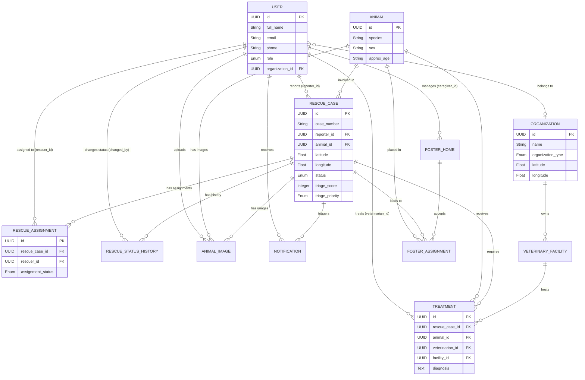

# PawReach Database Entity-Relationship Diagram

```mermaid
erDiagram
    USER ||--o{ RESCUE_CASE : "reports (reporter_id)"
    USER ||--o{ RESCUE_ASSIGNMENT : "assigned to (rescuer_id)"
    USER ||--o{ RESCUE_STATUS_HISTORY : "changes status (changed_by)"
    USER ||--o{ TREATMENT : "treats (veterinarian_id)"
    USER ||--o{ FOSTER_HOME : "manages (caregiver_id)"
    USER }o--o| ORGANIZATION : "belongs to"
    USER ||--o{ ANIMAL_IMAGE : "uploads"
    USER ||--o{ NOTIFICATION : "receives"

    ORGANIZATION ||--o{ VETERINARY_FACILITY : "owns"

    ANIMAL ||--o{ RESCUE_CASE : "involved in"
    ANIMAL ||--o{ ANIMAL_IMAGE : "has images"
    ANIMAL ||--o{ TREATMENT : "receives"
    ANIMAL ||--o{ FOSTER_ASSIGNMENT : "placed in"

    RESCUE_CASE ||--o{ RESCUE_STATUS_HISTORY : "has history"
    RESCUE_CASE ||--o{ RESCUE_ASSIGNMENT : "has assignments"
    RESCUE_CASE ||--o{ ANIMAL_IMAGE : "has images"
    RESCUE_CASE ||--o{ TREATMENT : "requires"
    RESCUE_CASE ||--o{ FOSTER_ASSIGNMENT : "leads to"
    RESCUE_CASE ||--o{ NOTIFICATION : "triggers"

    VETERINARY_FACILITY ||--o{ TREATMENT : "hosts"

    FOSTER_HOME ||--o{ FOSTER_ASSIGNMENT : "accepts"

    USER {
        UUID id PK
        String full_name
        String email
        String phone
        Enum role
        UUID organization_id FK
    }

    ORGANIZATION {
        UUID id PK
        String name
        Enum organization_type
        Float latitude
        Float longitude
    }

    ANIMAL {
        UUID id PK
        String species
        String sex
        String approx_age
    }

    RESCUE_CASE {
        UUID id PK
        String case_number
        UUID reporter_id FK
        UUID animal_id FK
        Float latitude
        Float longitude
        Enum status
        Integer triage_score
        Enum triage_priority
    }

    RESCUE_ASSIGNMENT {
        UUID id PK
        UUID rescue_case_id FK
        UUID rescuer_id FK
        Enum assignment_status
    }

    TREATMENT {
        UUID id PK
        UUID rescue_case_id FK
        UUID animal_id FK
        UUID veterinarian_id FK
        UUID facility_id FK
        Text diagnosis
    }
```
